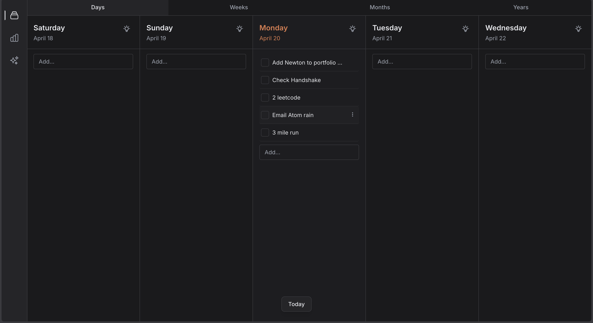

# Newton — Productivity Web App

A clean, horizon-based productivity platform: plan tasks across **Days, Weeks, Months, and Years**, drag them between time buckets, and get AI-powered reflections and day insights.



## Features

- **Horizon Views**: Switch between Days, Weeks, Months, and Years — each a five-column timeline centered on today.
- **Task Management**: Add, edit, complete, reschedule, and delete tasks in any bucket.
- **Drag & Drop**: Move tasks between days/weeks/months/years (powered by `@dnd-kit`).
- **Task Descriptions**: Rich descriptions with Markdown rendering.
- **Change Log**: Every mutation (add, edit, complete, uncomplete, delete, reschedule) is timestamped and grouped by date.
- **AI Day Insights**: Per-day summary / coaching, powered by Claude (via a local proxy) or Ollama.
- **AI Reflections Panel**: A dedicated view for longer-form weekly/periodic reflections.
- **Persistence**: Tasks, change log, reflections, and active horizon tab all persist in LocalStorage.

## Tech Stack

- **Frontend**: React 18 + Vite
- **Styling**: Tailwind CSS
- **Drag & Drop**: `@dnd-kit/core`, `@dnd-kit/sortable`
- **Markdown**: `react-markdown`
- **State**: React Context + `useReducer`
- **Persistence**: LocalStorage (MVP)
- **AI Proxy**: Node HTTP server (`server/coach-proxy.mjs`) forwarding to Anthropic
- **AI Providers**: Claude (Anthropic API) or local Ollama

## Architecture

### Layout

- `LeftSidebar`: Switch between Main, Progress (Change Log), and Reflections views.
- `HorizonMainView`: Tab bar (Days/Weeks/Months/Years) + the active timeline view.
- `DaysView` / `WeeksView` / `MonthsView` / `YearsView`: Five-column timelines rendered from `HorizonBucketColumn`.

### State

- `TaskContext`: Central task state; every mutation is logged to the ChangeLog.
- `ReflectionsContext`: Stores AI reflections per period.
- `DayInsightsContext`: Caches per-day AI insights so they aren't regenerated on every open.
- `HorizonDndUiContext`: Coordinates drag-and-drop UI state across the horizon.

### Components

- `HorizonBucketColumn`: Renders a single bucket (a day, week, month, or year) with its tasks.
- `Task`: Checkbox, title, description trigger, per-task actions.
- `TaskPopUp`: Expanded task editor.
- `AddTaskInput`: Inline add-task input on each bucket.
- `DayInsightsModal`: AI-generated insights for a single day.
- `ReflectionsPanel`: AI-generated reflections for the current horizon.
- `ChangeLog`: Progress panel grouped by date.
- `MarkdownContent`: Shared Markdown renderer for descriptions and AI output.

### Utilities

- `calendarHorizon.js`: Builds the five-bucket window (days/weeks/months/years) around today.
- `taskBuckets.js`: Groups tasks into their respective horizon buckets.
- `dndIds.js` / `dndCollision.js`: Drag-and-drop ID schemes and collision logic.
- `storage.js`: LocalStorage read/write for tasks, change log, reflections, insights, and active tab.
- `insightsCoach.js` / `ollamaCoach.js`: AI provider clients for day insights.
- `streamingFetch.js`: SSE / chunked-response helper for streaming AI output.

## Getting Started

```bash
npm install
npm run dev
```

Open [http://localhost:5173](http://localhost:5173).

### With AI Insights (Claude)

The Claude provider requires a small local proxy so your API key never ships to the browser.

1. Copy the environment template and fill it in:

   ```bash
   cp .env.example .env
   ```

   Set at least:

   ```bash
   ANTHROPIC_API_KEY=sk-ant-...
   VITE_INSIGHTS_PROVIDER=claude
   ```

2. Run the Vite dev server and the coach proxy together:

   ```bash
   npm run dev:full
   ```

   (Or run them in separate terminals: `npm run dev:coach-proxy` and `npm run dev`.)

3. Restart Vite after any `VITE_*` change. If insights still look stale, use the **Regenerate** button in the insights modal (results are cached in LocalStorage).

### With AI Insights (Ollama)

To use a local model via Ollama instead of Claude, set:

```bash
VITE_INSIGHTS_PROVIDER=ollama
```

No proxy is required — the app talks to your local Ollama instance directly.

## Scripts

| Script | Purpose |
|--------|---------|
| `npm run dev` | Start Vite dev server |
| `npm run dev:coach-proxy` | Start the Anthropic proxy on `COACH_PROXY_PORT` (default `8787`) |
| `npm run dev:full` | Run Vite and the coach proxy together via `concurrently` |
| `npm run build` | Production build |
| `npm run preview` | Preview the production build |

## Build

```bash
npm run build
npm run preview
```

## Future Backend Options

- **REST API**: Replace `storage.js` with fetch calls to Node + Express + SQLite.
- **Firebase**: Use Firestore for tasks, change log, reflections, and insights.
- **Supabase**: Postgres-backed, real-time subscriptions.
- **Deployed Coach Proxy**: Point `VITE_COACH_PROXY_URL` at a hosted version of `server/coach-proxy.mjs` for production AI insights.
